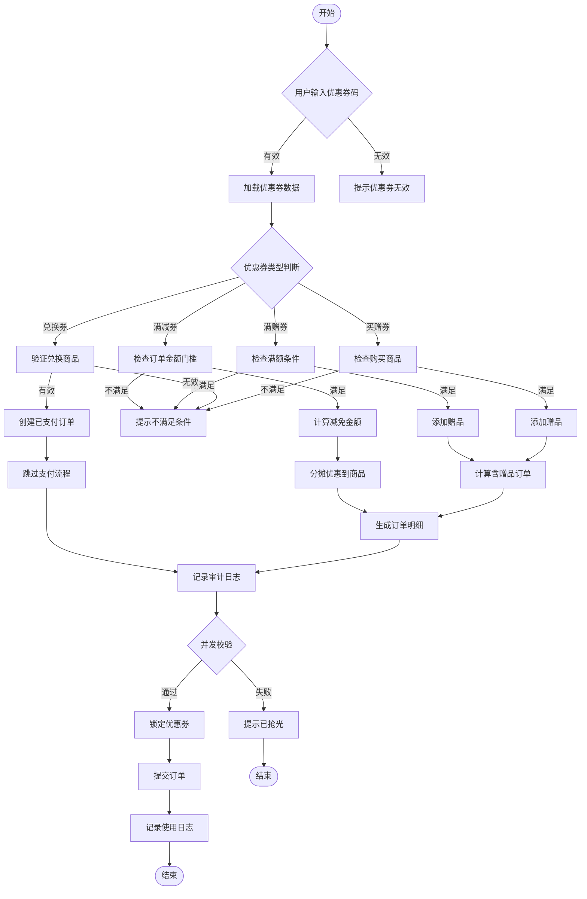
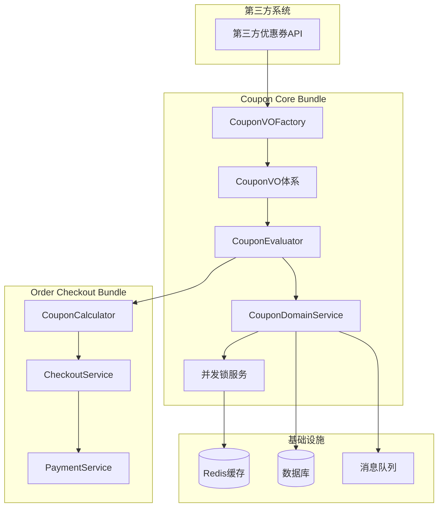

# 优惠券模块增强功能 PRD

## 1. 概述

### 1.1 背景
现有优惠券模块（`packages/coupon-core-bundle`）功能基础，无法满足复杂业务场景需求。为支持对接第三方优惠券系统，并实现多种优惠券类型的统一处理，需要完善优惠券模块，增加满赠券、兑换券、满减券、买赠券四种核心券型。

### 1.2 目标
- 构建统一的优惠券价值对象（VO）体系，支持第三方优惠券数据接入
- 实现四种标准券型的完整业务逻辑
- 与订单结算模块深度集成，支持复杂的优惠计算和分摊
- 确保高并发场景下的优惠券使用安全性
- 为未来扩展预留良好的架构基础

### 1.3 成功标准
- 四种券型功能完整，覆盖90%以上业务场景
- 优惠券计算准确率100%，支持复杂分摊算法
- 系统性能：优惠券计算响应时间<100ms
- 并发安全：支持1000 QPS优惠券核销无超发

## 2. 术语定义

| 术语 | 说明 |
|------|------|
| VO (Value Object) | 价值对象，用于封装业务数据和行为 |
| TRL (Technology Readiness Level) | 技术成熟度等级 |
| SKU (Stock Keeping Unit) | 最小库存单位 |
| SPU (Standard Product Unit) | 标准产品单位 |

## 3. 需求范围

### 3.1 功能需求矩阵

| 编号 | 需求 | 简要说明 | 优先级 | 主要责任方/团队 | 测试策略 | 备注 |
|------|------|----------|--------|---------------|----------|------|
| REQ-001 | 满减券 | 订单商品满N元减X元，按规则分摊 | P0 | 优惠券团队 | 单元+集成 | 支持按金额/数量分摊 |
| REQ-002 | 满赠券 | 满N元赠送指定商品 | P0 | 优惠券团队 | 单元+集成 | 赠品库存校验 |
| REQ-003 | 兑换券 | 直接兑换商品，生成已支付订单 | P0 | 优惠券团队 | 单元+集成 | 审计日志记录 |
| REQ-004 | 买赠券 | 购买X商品赠送N商品 | P0 | 优惠券团队 | 单元+集成 | 支持多买多赠 |
| REQ-005 | VO体系 | 统一的优惠券价值对象 | P0 | 优惠券团队 | 单元测试 | 支持第三方映射 |
| REQ-006 | 分摊算法 | 精确的优惠分摊计算 | P0 | 订单团队 | 单元+性能 | BCMath精度保证 |
| REQ-007 | 并发控制 | 防止超发和重复使用 | P1 | 基础架构 | 压力测试 | 分布式锁 |
| REQ-008 | 审计日志 | 优惠券使用全链路追踪 | P1 | 数据团队 | 集成测试 | 异步记录 |

### 3.2 产品流程图



### 3.3 系统架构图



## 4. 功能详细说明

### 4.1 优惠券类型定义

```php
enum CouponType: string {
    case FULL_REDUCTION = 'full_reduction';  // 满减券
    case FULL_GIFT = 'full_gift';            // 满赠券
    case REDEEM = 'redeem';                  // 兑换券
    case BUY_GIFT = 'buy_gift';              // 买赠券
}
```

### 4.2 满减券（REQ-001）

#### 4.2.1 业务规则
- 订单中指定商品金额满N元减X元
- 支持按SKU金额占比分摊减免金额
- 支持排除特定商品不参与优惠
- 可设置最低消费门槛

#### 4.2.2 计算逻辑
1. 过滤订单中适用优惠券的商品
2. 计算适用商品总金额
3. 判断是否满足优惠门槛
4. 计算优惠金额并进行分摊
5. 生成分摊明细记录

### 4.3 满赠券（REQ-002）

#### 4.3.1 业务规则
- 订单金额满N元赠送指定商品
- 赠品价格为0，需计算运费
- 赠品库存不足时自动取消
- 支持多档满赠（满200送A，满500送B）

#### 4.3.2 计算逻辑
1. 计算订单总金额（不含其他优惠）
2. 判断满足哪个满赠档位
3. 检查赠品库存
4. 将赠品加入订单（价格0）
5. 生成赠品记录

### 4.4 兑换券（REQ-003）

#### 4.4.1 业务规则
- 直接兑换指定商品，无需支付
- 订单状态直接标记为"已支付-兑换券"
- 支持虚拟商品直接到账
- 实物商品触发发货流程

#### 4.4.2 业务流程
1. 验证兑换券有效性
2. 验证兑换商品库存
3. 创建订单（已支付状态）
4. 扣减优惠券库存
5. 记录兑换日志
6. 触发后续流程（发货/到账）

### 4.5 买赠券（REQ-004）

#### 4.5.1 业务规则
- 购买X商品赠送N商品
- 支持多买多赠（买2送1，买4送2）
- 主商品和赠品可以是不同SKU
- 支持设置赠送上限

#### 4.5.2 计算逻辑
1. 统计主商品购买数量
2. 根据规则计算应赠数量
3. 检查赠品库存
4. 将赠品加入订单
5. 记录买赠关系

### 4.6 VO体系设计（REQ-005）

#### 4.6.1 基础VO结构
```php
abstract class CouponVO {
    protected string $code;              // 优惠券码
    protected CouponType $type;          // 优惠券类型
    protected string $name;              // 优惠券名称
    protected DateTime $validFrom;       // 有效期开始
    protected DateTime $validTo;         // 有效期结束
    protected CouponScopeVO $scope;      // 适用范围
    protected CouponConditionVO $condition; // 使用条件
    protected CouponBenefitVO $benefit;  // 优惠内容
}

// 满减券VO
class FullReductionCouponVO extends CouponVO {
    protected string $thresholdAmount;   // 门槛金额
    protected string $discountAmount;    // 减免金额
    protected AllocationRule $allocation; // 分摊规则
}

// 满赠券VO
class FullGiftCouponVO extends CouponVO {
    protected array $thresholds;         // 档位配置
    protected array $giftSkus;           // 赠品列表
}

// 兑换券VO
class RedeemCouponVO extends CouponVO {
    protected array $redeemableSkus;     // 可兑换商品
    protected int $maxQuantity;          // 兑换数量限制
}

// 买赠券VO
class BuyGiftCouponVO extends CouponVO {
    protected array $buySkus;            // 主商品列表
    protected array $giftSkus;           // 赠品列表
    protected string $buyQuantity;       // 购买数量
    protected string $giftQuantity;      // 赠送数量
    protected int $maxGifts;             // 最大赠送数
}
```

### 4.7 分摊算法（REQ-006）

#### 4.7.1 分摊策略
- **按金额比例分摊**：根据商品金额占比分配优惠
- **平均分摊**：优惠金额平均分配到各商品
- **优先分摊**：优先分摊到指定商品

#### 4.7.2 精度处理
- 使用BCMath进行精确计算
- 舍入误差分配给金额最大的商品
- 保证分摊总额等于优惠总额

## 5. 权限控制

### 5.1 角色权限矩阵

| 角色 | 创建优惠券 | 编辑优惠券 | 删除优惠券 | 使用优惠券 | 查看报表 |
|------|-----------|-----------|-----------|-----------|----------|
| 超级管理员 | ✓ | ✓ | ✓ | ✗ | ✓ |
| 运营人员 | ✓ | ✓ | ✗ | ✗ | ✓ |
| 财务人员 | ✗ | ✗ | ✗ | ✗ | ✓ |
| 普通用户 | ✗ | ✗ | ✗ | ✓ | ✗ |

### 5.2 API权限控制
- 管理接口需要管理员权限
- 使用接口需要用户登录
- 第三方接口需要API Key认证

## 6. 风险识别与缓解

### 6.1 风险评估矩阵

| 风险项 | 概率 | 影响 | 风险等级 | 缓解方案 | 负责人 |
|--------|------|------|----------|----------|--------|
| 并发超发 | 中 | 高 | 高 | 分布式锁+库存预占 | 架构师 |
| 计算错误 | 低 | 高 | 中 | 单元测试+代码审查 | 开发团队 |
| 性能问题 | 中 | 中 | 中 | 缓存+异步处理 | 性能团队 |
| 数据一致 | 低 | 高 | 中 | 事务+补偿机制 | DBA团队 |

### 6.2 缓解措施详情

#### 6.2.1 并发控制方案
```php
// 使用Redis分布式锁
$lockKey = "coupon:lock:{$couponCode}";
$lock = $redis->set($lockKey, 1, 'EX', 10, 'NX');
if (!$lock) {
    throw new CouponLockException("系统繁忙，请稍后重试");
}

try {
    // 执行优惠券核销逻辑
    $this->applyCoupon($couponCode, $order);
} finally {
    $redis->del($lockKey);
}
```

#### 6.2.2 数据一致性保障
- 使用数据库事务确保订单和优惠券状态一致
- 异常情况下通过补偿机制修复数据
- 关键操作记录审计日志

## 7. 验收标准

### 7.1 功能验收
- [ ] 四种优惠券类型业务流程正常
- [ ] VO体系支持第三方数据映射
- [ ] 分摊算法计算准确（精度到分）
- [ ] 并发测试通过（1000 QPS无超发）
- [ ] 异常场景处理正确

### 7.2 性能验收
- 优惠券计算响应时间 < 100ms (P99)
- 订单结算包含优惠券计算 < 500ms
- 支持10000张优惠券同时生效
- 系统可用性 > 99.9%

### 7.3 安全验收
- 通过并发压力测试
- 无重复使用漏洞
- 无权限绕过漏洞
- 审计日志完整可追溯

## 8. 技术方案

### 8.1 架构设计

#### 8.1.1 分层架构
```
Presentation Layer
├── Controller (优惠券管理、使用接口)
├── DTO (请求响应数据传输)
└── Exception (异常处理)

Application Layer
├── CouponApplicationService (应用服务)
├── CouponVOFactory (VO工厂)
└── CouponEvaluator (评估器)

Domain Layer
├── CouponVO (价值对象)
├── CouponDomainService (领域服务)
├── CouponRepository (仓储接口)
└── Domain Events (领域事件)

Infrastructure Layer
├── Redis (缓存、分布式锁)
├── Database (数据持久化)
└── HttpClient (第三方API调用)
```

### 8.2 核心组件设计

#### 8.2.1 CouponEvaluator（优惠券评估器）
```php
class CouponEvaluator {
    public function evaluate(
        CouponVO $coupon, 
        CalculationContext $context
    ): CouponApplicationResult {
        // 1. 验证优惠券有效性
        $this->validateCoupon($coupon, $context);
        
        // 2. 计算优惠
        $result = match($coupon->getType()) {
            CouponType::FULL_REDUCTION => $this->evaluateFullReduction($coupon, $context),
            CouponType::FULL_GIFT => $this->evaluateFullGift($coupon, $context),
            CouponType::REDEEM => $this->evaluateRedeem($coupon, $context),
            CouponType::BUY_GIFT => $this->evaluateBuyGift($coupon, $context),
        };
        
        // 3. 分摊优惠
        if ($result->hasDiscount()) {
            $result = $this->allocateDiscount($result, $context);
        }
        
        return $result;
    }
}
```

#### 8.2.2 CouponCalculator（订单结算计算器）
```php
class CouponCalculator implements PriceCalculatorInterface {
    public function calculate(CalculationContext $context): PriceResult {
        $coupons = $this->extractCoupons($context);
        $totalResult = PriceResult::empty();
        
        foreach ($coupons as $couponCode) {
            $couponVO = $this->couponService->getCouponVO($couponCode);
            $result = $this->evaluator->evaluate($couponVO, $context);
            
            // 处理兑换券特殊流程
            if ($couponVO->getType() === CouponType::REDEEM) {
                $this->handleRedeemCoupon($result, $context);
            }
            
            $totalResult = $totalResult->merge($result->toPriceResult());
        }
        
        return $totalResult;
    }
}
```

### 8.3 数据库设计

#### 8.3.1 新增表结构

```sql
-- 优惠券使用记录表
CREATE TABLE coupon_usage_log (
    id BIGINT PRIMARY KEY AUTO_INCREMENT,
    coupon_code VARCHAR(100) NOT NULL,
    user_id BIGINT NOT NULL,
    order_id BIGINT,
    usage_time DATETIME NOT NULL,
    discount_amount DECIMAL(10,2) DEFAULT 0,
    coupon_type VARCHAR(50) NOT NULL,
    created_at DATETIME DEFAULT CURRENT_TIMESTAMP,
    INDEX idx_coupon_code (coupon_code),
    INDEX idx_user_id (user_id),
    INDEX idx_order_id (order_id)
);

-- 优惠券分摊明细表
CREATE TABLE coupon_allocation_detail (
    id BIGINT PRIMARY KEY AUTO_INCREMENT,
    coupon_code VARCHAR(100) NOT NULL,
    order_id BIGINT NOT NULL,
    order_item_id BIGINT NOT NULL,
    sku_id BIGINT NOT NULL,
    allocated_amount DECIMAL(10,2) NOT NULL,
    allocation_rule VARCHAR(50),
    created_at DATETIME DEFAULT CURRENT_TIMESTAMP,
    INDEX idx_coupon_order (coupon_code, order_id)
);
```

### 8.4 缓存策略

#### 8.4.1 多级缓存设计
- **L1缓存**：本地缓存（优惠券模板数据，TTL: 5分钟）
- **L2缓存**：Redis缓存（用户优惠券列表，TTL: 30分钟）
- **L3缓存**：数据库（持久化存储）

#### 8.4.2 缓存更新策略
- 优惠券核销时立即清除相关缓存
- 使用消息队列异步更新缓存
- 支持缓存预热和降级

## 9. 实施计划

### 9.1 里程碑规划

| 阶段 | 时间 | 主要任务 | 交付物 | 负责人 |
|------|------|----------|--------|--------|
| Phase 1 | W1-W2 | 基础架构搭建 | VO体系、基础服务 | 架构师 |
| Phase 2 | W3-W4 | 满减券开发 | 完整功能+测试 | 开发团队A |
| Phase 3 | W5-W6 | 满赠券开发 | 完整功能+测试 | 开发团队B |
| Phase 4 | W7 | 兑换券开发 | 完整功能+测试 | 开发团队C |
| Phase 5 | W8 | 买赠券开发 | 完整功能+测试 | 开发团队D |
| Phase 6 | W9 | 集成测试 | 端到端测试 | QA团队 |
| Phase 7 | W10 | 性能优化 | 性能达标 | 性能团队 |
| Phase 8 | W11 | 上线准备 | 部署文档 | 运维团队 |
| Phase 9 | W12 | 生产发布 | 灰度发布 | 项目经理 |

### 9.2 详细任务分解

#### Phase 1: 基础架构（W1-W2）
- [ ] 定义CouponType枚举
- [ ] 实现CouponVO基础类
- [ ] 实现四种具体CouponVO
- [ ] 实现CouponVOFactory
- [ ] 搭建CouponDomainService
- [ ] 配置Redis缓存
- [ ] 编写基础单元测试

#### Phase 2: 满减券（W3-W4）
- [ ] 实现FullReductionCouponVO
- [ ] 实现满减券计算逻辑
- [ ] 实现分摊算法
- [ ] 集成到订单结算
- [ ] 编写单元测试
- [ ] 编写集成测试

### 9.3 资源需求

| 角色 | 人数 | 投入比例 | 主要职责 |
|------|------|----------|----------|
| 架构师 | 1 | 50% | 架构设计、核心组件 |
| 后端开发 | 4 | 100% | 功能实现 |
| 前端开发 | 2 | 60% | 管理界面、用户界面 |
| 测试工程师 | 2 | 100% | 测试用例、自动化测试 |
| 运维工程师 | 1 | 30% | 部署、监控 |
| 产品经理 | 1 | 70% | 需求管理、进度协调 |

### 9.4 风险应对

| 风险 | 应对措施 | 触发条件 | 负责人 |
|------|----------|----------|--------|
| 进度延期 | 增加人力、削减范围 | 延期超过3天 | 项目经理 |
| 技术难题 | 组织技术评审、寻求外援 | 阻塞超过2天 | 技术总监 |
| 人员变动 | 知识沉淀、文档完善 | 关键人员离职 | HR |
| 需求变更 | 评估影响、排期调整 | 变更影响>3天 | 产品经理 |

## 10. 附录

### 10.1 相关文档
- [优惠券技术设计文档](./coupon-tech-design.md)
- [API接口文档](./coupon-api-docs.md)
- [数据库设计文档](./coupon-db-design.md)

### 10.2 版本历史

| 版本 | 日期 | 作者 | 变更内容 |
|------|------|------|----------|
| v1.0 | 2025-10-20 | Claude | 初稿完成 |
| | | | |

---

**文档状态**: 草稿  
**最后更新**: 2025-10-20  
**审批状态**: 待审核